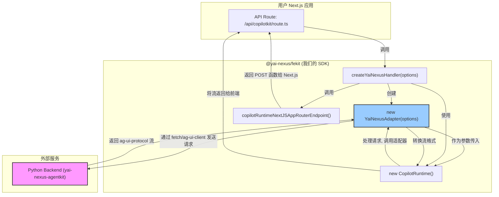

# 开发计划与方案 (v3)

本文档基于我们已经完成的初始化工作，并融合了 `next-ai-chat-sdk` 方案的优点以及对 `CopilotKit` 后端运行时更深入的理解，为 `yai-nexus-fekit` SDK 的后续开发制定详细的计划。

## 1. SDK 核心价值与设计原则

### 核心价值
本 SDK 旨在提供一个功能强大的工具集，让开发者可以极速地将一个基于 `CopilotKit` 的前端应用，同一个基于 `yai-nexus-agentkit` 的 Python 后端服务连接起来，并提供卓越的开箱即用的用户体验。

它的核心价值体现在两个层面：
1.  **后端连接器 (Connector):** 封装 `ag-ui-protocol` 的所有通信细节，作为一个可靠的桥梁，无缝连接前端与 Python 后端。
2.  **体验增强器 (Enhancer):** 提供客户端能力，例如自动化的聊天记录本地持久化，极大提升最终用户的体验，而无需应用开发者编写额外代码。

### 设计原则
- **遵循官方生态:** 深度集成 `CopilotKit` 的核心运行时 (`CopilotRuntime`)，保证健壮性与未来兼容性。
- **专用适配:** 通过自定义适配器 (`Adapter`) 模式，深度集成 `ag-ui-protocol`，专注于与 `yai-nexus-agentkit` 的适配。
- **低侵入性:** 尽可能少地要求应用层进行代码改造。
- **关注点分离:** 将“后端通信”和“前端持久化”这两个通用关注点下沉到 SDK，让主应用更专注于业务本身。

---

## 2. SDK 核心 API 设计

本 SDK 将导出两个核心功能：

- `createYaiNexusHandler` (服务端函数)
- `YaiNexusPersistenceProvider` (客户端组件)

### 2.1. `createYaiNexusHandler(options)`

一个在 Next.js API 路由中使用的**服务端工厂函数**，它基于 `CopilotKit` 的运行时来创建一个完整的后端端点。

**API 设计 (示例):**
```typescript
// /src/app/api/copilotkit/route.ts
import { createYaiNexusHandler } from "@yai-nexus/fekit";

// 只需一行代码，即可创建一个功能完备、可与 Python 后端对话的 API 端点
export const POST = createYaiNexusHandler({
  backendUrl: process.env.PYTHON_BACKEND_URL, 
});
```

**Options 接口:**
- `backendUrl: string`: 指向 `yai-nexus-agentkit` 后端服务的 URL。

### 2.2. `YaiNexusPersistenceProvider(props)`

一个客户端 React 组件，其职责是为 `CopilotKit` 的聊天组件**提供自动化的本地持久化能力**。
(此部分设计保持不变)

**API 设计 (示例):**
```typescript
// /src/app/page.tsx
import { CopilotKit } from "@copilotkit/react-core";
import { CopilotChat } from "@copilotkit/react-ui";
import { YaiNexusPersistenceProvider } from "@yai-nexus/fekit";

function ChatPage() {
  const userId = "user_12345";
  const conversationId = "default-chat";

  return (
    <CopilotKit url="/api/copilotkit">
      <YaiNexusPersistenceProvider
        userId={userId}
        conversationId={conversationId}
      >
        <CopilotChat />
      </YaiNexusPersistenceProvider>
    </CopilotKit>
  );
}
```

---

## 3. 架构与实施步骤

### 3.1 核心后端架构

我们将采用一个基于 `CopilotRuntime` 和自定义适配器的模式，来处理后端逻辑。



### 3.2 实施步骤

1.  **配置 Monorepo Workspaces (已完成)**
    -   已在根目录配置 `package.json` 的 `workspaces`，实现了本地包的无缝链接。

2.  **实现核心后端逻辑**
    -   **2.1. 创建自定义适配器**:
        -   在 `packages/yai-nexus-fekit/src/` 中创建 `adapter.ts`。
        -   定义 `YaiNexusAdapter` 类，它需要实现 `CopilotKit` 的语言模型适配器接口（例如，需要一个 `process` 方法）。
        -   `process` 方法的内部逻辑是：
            -   接收来自 `CopilotRuntime` 的消息。
            -   使用 `fetch` 或 `@ag-ui/client` 将这些消息代理到 `backendUrl`。
            -   接收 `ag-ui-protocol` 的响应流。
            -   将响应流转换为 `CopilotRuntime` 所需的 `ToolCall` 或 `TextStream` 格式。
    -   **2.2. 实现工厂函数**:
        -   在 `packages/yai-nexus-fekit/src/` 中创建 `handler.ts`。
        -   实现 `createYaiNexusHandler` 函数。它的职责是：
            -   实例化我们自定义的 `YaiNexusAdapter`。
            -   实例化 `CopilotRuntime`，并将 adapter 传入。
            -   调用 `copilotRuntimeNextJSAppRouterEndpoint` 来生成并返回最终的 Next.js `POST` 处理函数。
    -   **2.3. 更新 SDK 入口**:
        -   在 `.../src/index.ts` 中导出 `createYaiNexusHandler`。

3.  **实现前端持久化 Provider**
    -   在 `.../src/` 中创建 `storage.ts`，使用 `idb` 或类似的库封装 IndexedDB 的所有操作 (get, set, clear)。
    -   在 `.../src/` 中创建 `provider.tsx`，实现 `YaiNexusPersistenceProvider` 组件。
    -   在 `.../src/index.ts` 中导出 `YaiNexusPersistenceProvider`。

4.  **完善并联调示例应用**
    -   与 v2 计划一致，但测试时需重点关注 `CopilotRuntime` 的行为和 `YaiNexusAdapter` 的数据转换是否正确。

5.  **文档与发布**
    -   与 v2 计划一致，文档中需要对新的内部架构做出说明，以体现其健壮性。 