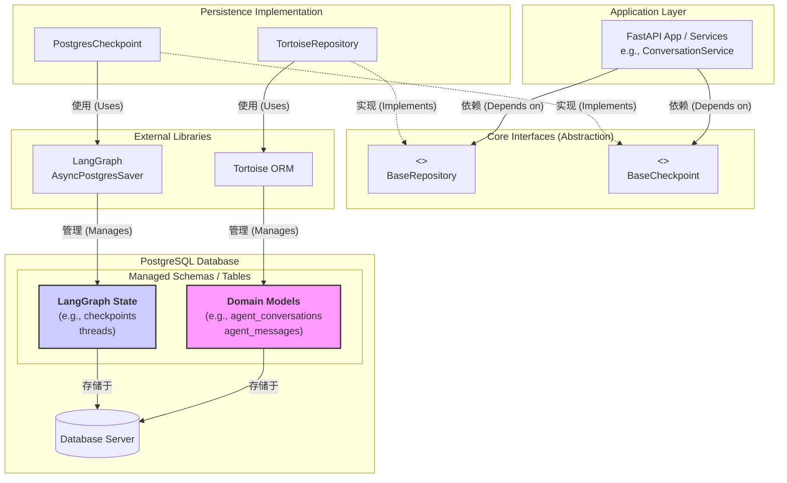
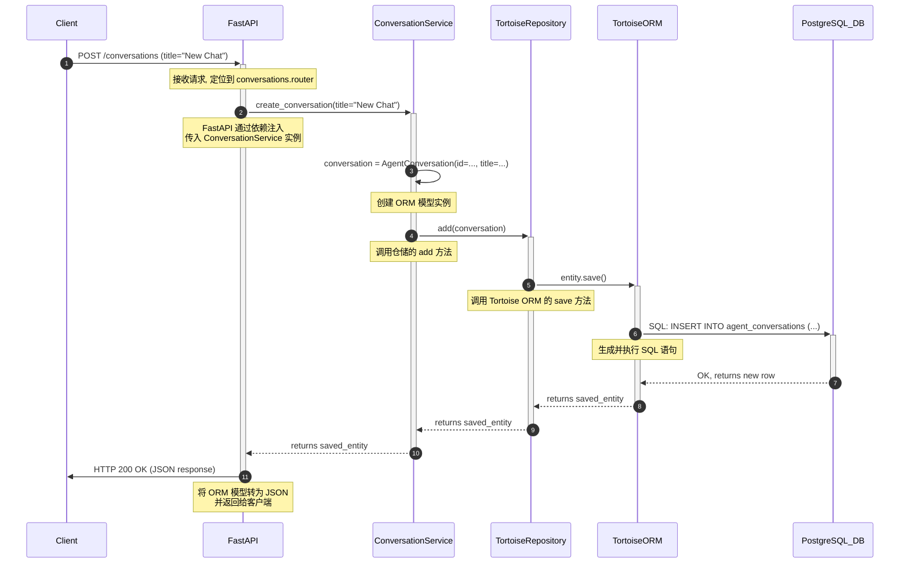
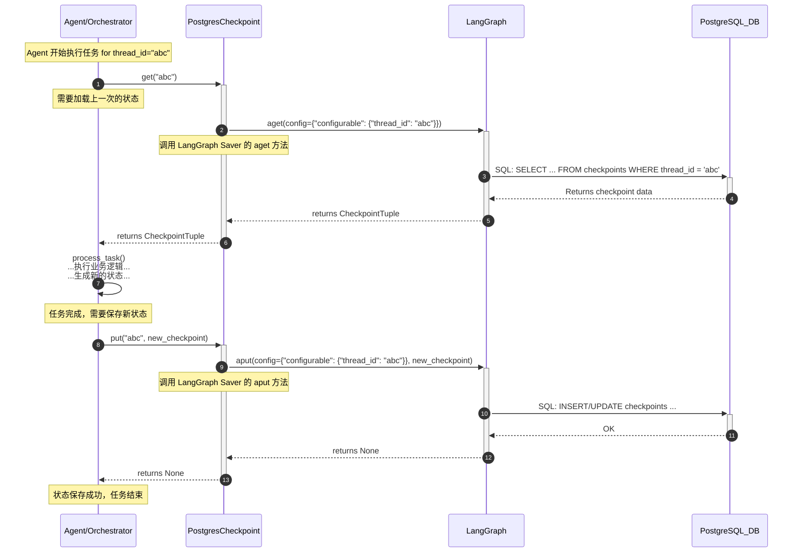
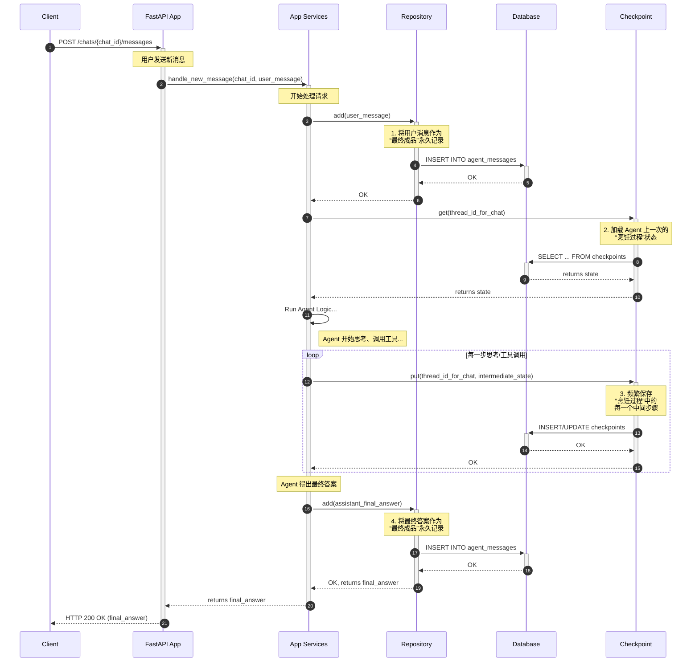
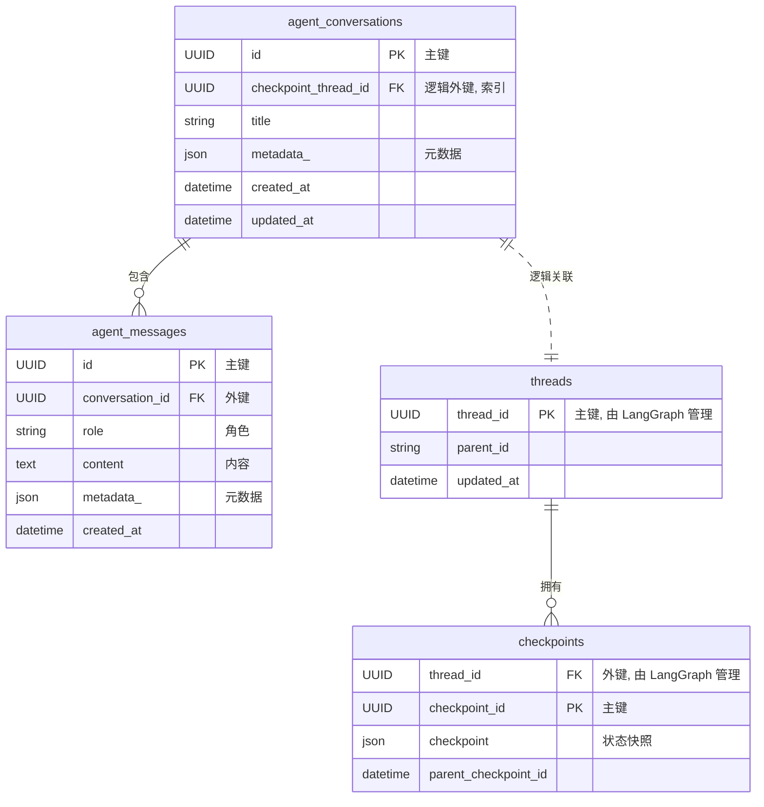

# 持久化系统架构图

下面是 `yai-nexus-agentkit` 持久化系统的架构图，展示了主要组件及其相互关系。

## 架构图 (Mermaid)

## 架构解读

### 1. 分层结构

- **应用层 (Application Layer)**: 这是系统的最高层，例如 FastAPI 应用中的 `ConversationService`。它不关心数据具体是怎么存的，只依赖于下一层的抽象接口。
- **核心接口 (Core Interfaces)**: 这是我们设计的“契约层”，包含了 `BaseRepository` 和 `BaseCheckpoint` 两个抽象基类。它们定义了持久化操作应该具备哪些能力（如 `get`, `list`, `put`, `delete` 等）。
- **持久化实现 (Persistence Implementation)**: 这是接口的具体实现层。`TortoiseRepository` 实现了 `BaseRepository`，而 `PostgresCheckpoint` 实现了 `BaseCheckpoint`。
- **外部库 (External Libraries)**: 我们的实现依赖于外部的库。`TortoiseRepository` 依赖 `Tortoise ORM` 来操作数据库，`PostgresCheckpoint` 则依赖 `LangGraph` 的 `AsyncPostgresSaver`。
- **数据库 (PostgreSQL Database)**: 这是所有数据的最终归宿。

### 2. Repository 与 Checkpoint 的关系

从图中可以清晰地看出：

- **没有直接关系**: `TortoiseRepository` 和 `PostgresCheckpoint` 之间**没有任何箭头连接**。它们在代码层面是完全解耦的，互相不知道对方的存在。
- **共享底层资源**: 它们都通过各自依赖的库（`Tortoise ORM` 和 `LangGraph`）最终将数据写入同一个 **PostgreSQL 数据库**。
- **管理不同数据**:
  - `TortoiseRepository` 通过 `Tortoise ORM` 管理的是我们自己定义的**领域模型**（如 `agent_conversations` 表）。
  - `PostgresCheckpoint` 通过 `LangGraph` 管理的是 `LangGraph` 自己的**状态数据**（如 `checkpoints` 表）。

这种设计非常好，因为它实现了**关注点分离 (Separation of Concerns)**。管理业务数据的逻辑和管理 Agent 状态的逻辑被清晰地分开，它们只是碰巧使用了同一个数据库实例而已，这使得整个系统非常清晰和易于维护。

## 交互时序图

下面的时序图展示了当一个请求到达时，系统内部各组件的交互顺序。

### 示例：创建一个新的对话

这个例子展示了从接收到 API 请求到最终将数据存入数据库的完整流程。

### 时序图解读

1.  **客户端请求**: 外部客户端（如浏览器或另一个服务）向 FastAPI 应用发送一个 `POST` 请求来创建新的对话。
2.  **服务层调用**: FastAPI 将请求路由到 `ConversationService` 的 `create_conversation` 方法。
3.  **实体创建**: `ConversationService` 负责业务逻辑，它创建一个 `AgentConversation` 的模型实例。
4.  **仓储层处理**: 服务层调用 `TortoiseRepository` 的 `add` 方法来持久化这个实体。服务层本身并不知道具体的数据库操作。
5.  **ORM 执行**: `TortoiseRepository` 委托 `TortoiseORM` 库来处理数据库交互。
6.  **数据库操作**: `TortoiseORM` 生成对应的 `INSERT` SQL 语句，并发送给 PostgreSQL 数据库执行。
7.  **成功返回**: 操作结果沿着调用链逐层返回，最终 FastAPI 将新创建的对话数据以 JSON 格式返回给客户端。

这个流程清晰地展示了各层如何各司其职：
- **FastAPI** 负责网络和路由。
- **Service** 负责业务逻辑。
- **Repository** 负责数据访问的抽象。
- **ORM** 负责将对象映射到数据库记录。
- **Database** 负责数据的可靠存储。

### 示例：Agent 存取执行状态 (Checkpoint)

这个例子展示了 Agent 在执行任务时，如何通过 Checkpoint 系统加载和保存自己的状态。

### 时序图解读

1.  **加载状态**: Agent/Orchestrator（任务编排器）为了继续一个任务，调用 `PostgresCheckpoint` 的 `get` 方法来获取该任务（以 `thread_id` 标识）的最后一个检查点。
2.  **调用 LangGraph**: `PostgresCheckpoint` 将这个请求委托给它内部的 `LangGraph AsyncPostgresSaver` 实例。
3.  **数据库查询**: `LangGraph` 负责生成精确的 `SELECT` SQL 语句来从数据库中检索状态数据。
4.  **返回状态**: 检索到的状态数据沿着调用链返回给 Agent。
5.  **执行任务**: Agent 在获取到历史状态后，执行自己的业务逻辑，并产生一个新的状态。
6.  **保存状态**: 任务执行完毕后，Agent 调用 `put` 方法，将新生成的状态（`new_checkpoint`）传入 `PostgresCheckpoint`。
7.  **写入数据库**: 和获取时类似，`PostgresCheckpoint` 再次委托 `LangGraph`，由 `LangGraph` 生成 `INSERT` 或 `UPDATE` SQL 语句，将新状态写入数据库。
8.  **完成**: 状态成功保存，整个执行周期完成。

这个流程展示了 `Checkpoint` 系统如何作为 Agent 的“外部记忆”，让 Agent 能够实现有状态的、可中断的、可恢复的长时间任务执行。它与 `Repository` 的交互流程是完全独立的。 

### 示例：一个完整的 Agent 交互回合

这个例子融合了前两个场景，展示了当用户发送一条消息，Agent 进行处理并最终返回答案的完整生命周期。这最能体现 Repository 和 Checkpoint 的协同关系。

### 时序图解读：协同工作

这个流程清晰地展示了两个系统如何在一个请求生命周期内协同工作：

1.  **记录输入**: 用户消息首先通过 `Repository` 被记录下来，成为对话历史的一部分。
2.  **加载执行状态**: `Checkpoint` 被用来加载 Agent 的上一次执行状态，以便继续工作。
3.  **记录执行过程**: 在 Agent 运行的每一步，`Checkpoint` 都会被用来保存中间状态，确保任务的可恢复性。
4.  **记录输出**: 当 Agent 完成工作并生成最终答案后，这个答案再次通过 `Repository` 被记录下来，成为对话历史的永久部分。

**结论**: `Repository` 和 `Checkpoint` 是为不同目的设计的两个独立系统。但在一个完整的、复杂的业务场景（如 Agent 交互）中，它们会被上层逻辑**协同调用**，分别扮演“记录员”（记录最终结果）和“场记”（记录过程状态）的角色，共同完成任务。 

## 实体关系图 (ER Diagram)

下面的 ER 图展示了数据库中核心表的结构以及它们之间的关系。

### 修改建议

为了能将业务对话 (`agent_conversations`) 与其对应的 Agent 执行状态 (`threads`/`checkpoints`) 可靠地关联起来，**建议为 `agent_conversations` 表增加一个 `checkpoint_thread_id` 字段**。该字段应设置为索引以提高查询性能。

### ER 图 (基于修改建议)

### ER 图解读

1.  **核心业务表**:
    - `agent_conversations`: 存储核心的对话元数据。每个对话有一个唯一的 `id`。
    - `agent_messages`: 存储每一条具体的消息，通过 `conversation_id` 与 `agent_conversations` 建立一对多关系。

2.  **LangGraph 状态表**:
    - `threads`: `LangGraph` 用来标识一个独立的、可延续的执行序列（对应我们的一个“对话”）。主键是 `thread_id`。
    - `checkpoints`: 存储 `threads` 中每个时间点的具体状态快照。

3.  **关键的逻辑关联**:
    - 图中 `agent_conversations` 和 `threads` 之间的**虚线**是整个架构的核心关联点。
    - `agent_conversations.checkpoint_thread_id` 字段存储了 `threads.thread_id` 的值。
    - 这种关系是**逻辑上的**，在数据库层面没有设置强制的外键约束，以避免两个系统（我们的应用 vs LangGraph）的 schema 管理发生冲突。
    - 通过这个 `checkpoint_thread_id`，我们就能从一个业务对话（`Conversation`）找到它所有对应的执行过程快照（`Checkpoints`），反之亦然。 