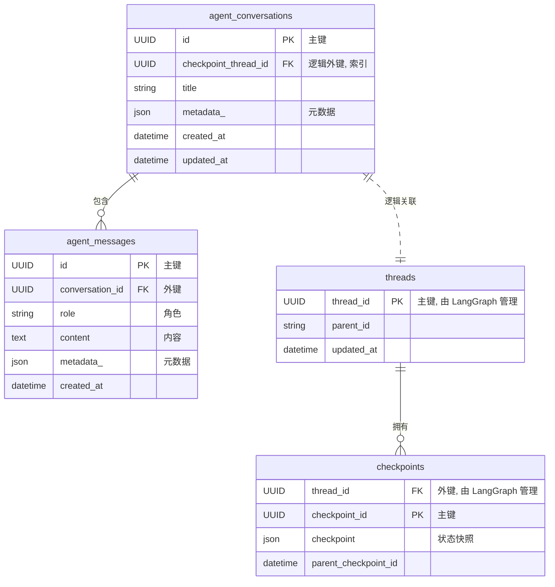

# 优化方案: 004-持久化层增强

**状态:** 已提议 (Proposed)
**创建者:** Gemini 2.5 Pro
**日期:** 2024-07-26

---

## 1. 概述

本文档基于对 `tech-design-004` 第二轮代码交付的深入评审和讨论，提出了一系列针对持久化层的优化建议。

当前持久化层的实现已通过评审，功能完备且已集成。本方案旨在基于现有良好实践，进一步**提升系统的健壮性、数据一致性和长期可维护性**。

核心优化点包括：
1.  建立 `Conversation` 业务实体与 `Checkpoint` 执行状态之间的显式、可靠的关联。
2.  完善 `PostgresCheckpoint` 的功能，使其完全符合 `BaseCheckpoint` 接口契约。

## 2. 核心优化项

### 2.1. 增强 Conversation 与 Checkpoint 的关联

**现状:**
`agent_conversations` 表（业务数据）与 `threads` 表（由 LangGraph 管理的执行状态）之间没有物理或逻辑上的直接关联。这使得我们无法从一个业务对话可靠地追溯到其对应的 Agent 执行历史，反之亦然。

**优化方案:**
为 `agent_conversations` 表（即 `persistence/models/conversation.py` 中的 `AgentConversation` 模型）增加一个新字段，用于存储其对应的 LangGraph `thread_id`。

- **字段命名:** 经过讨论，建议采用**`checkpoint_thread_id`**。
  - 这个名字在准确性（`thread_id`）和自解释性（隶属于 `Checkpoint` 系统）之间取得了最佳平衡，优于单纯的 `thread_id` 或与具体库绑定的 `langgraph_thread_id`。
- **字段属性:**
  - 类型: `fields.UUIDField`
  - 唯一性: `unique=True` (强制一对一关系)
  - 索引: `index=True` (提高查询性能)
  - 可空: `null=False` (确保每个对话创建时都必须关联一个执行线程)

**实施要点:**
- 修改 `ConversationService.create_conversation` 方法，在创建 `AgentConversation` 实例时，应同时生成一个 UUID 并将其赋值给 `id` 和 `checkpoint_thread_id` 两个字段。
- **注意:** 我们最终决定不采用共享主键（即让 `id` 和 `thread_id` 字段合并），是为了保持系统与外部库 `LangGraph` 的解耦，这是一种更稳健、更具扩展性的长远设计。

**价值:**
- **数据完整性:** 建立了业务逻辑和执行状态之间不可变的一一对应关系。
- **可追溯性:** 使得系统可以轻松地在两个核心概念之间进行双向查询。
- **架构清晰:** 让这种重要的关联关系在数据模型层面变得明确可见。

### 2.2. 完善 `PostgresCheckpoint.list` 的实现

**现状:**
`PostgresCheckpoint.list` 方法由于依赖的 `langgraph.checkpoint.postgres.AsyncPostgresSaver` 缺少直接列出所有线程的 API，目前仅返回一个空列表和一条警告日志。这虽然在工程上可以接受，但并未完全履行 `BaseCheckpoint` 的接口契约。

**优化方案:**
修改 `PostgresCheckpoint.list` 的实现，**绕过 `AsyncPostgresSaver`**，通过 `Tortoise ORM` 的能力直接执行原生 SQL 查询来获取所有 `thread_id`。

**实施要点:**
- 在 `list` 方法内部，使用 `Tortoise.get_connection("default")` 获取数据库连接。
- 执行一个类似 `SELECT thread_id FROM "threads" LIMIT :limit` 的原生 SQL 查询。
- **注意:** 需要妥善处理数据库连接和异常情况。

**价值:**
- **功能完整:** 使得 `PostgresCheckpoint` 100% 符合 `BaseCheckpoint` 的接口定义。
- **提升可管理性:** 为系统监控、调试和管理后台等未来功能提供了必要的数据基础。

## 3. 实施计划

1.  **数据库迁移**:
    - 使用 `aerich` 工具创建一个新的迁移文件。
    - 在迁移文件中添加为 `agent_conversations` 表增加 `checkpoint_thread_id` 列的指令。

2.  **模型更新**:
    - 修改 `src/yai_nexus_agentkit/persistence/models/conversation.py`，为 `AgentConversation` 模型添加 `checkpoint_thread_id` 字段定义。

3.  **服务逻辑更新**:
    - 修改 `examples/fast_api_app/core/services.py` 中的 `ConversationService.create_conversation` 方法。
    - 在创建 `AgentConversation` 实例时，生成一个 UUID，并同时赋值给 `id` 和 `checkpoint_thread_id`。

4.  **Checkpoint 实现更新**:
    - 修改 `src/yai_nexus_agentkit/persistence/checkpoint.py` 中的 `PostgresCheckpoint.list` 方法，替换为直接执行 SQL 查询的实现。

5.  **文档更新**:
    - 更新 `persistence_architecture.md` 中的 ER 图，将 `checkpoint_thread_id` 字段添加到 `agent_conversations` 实体中，并将表示关联的虚线改为实线或更新其描述，以反映这一显式关联。

## 4. 附录：最终的 ER 模型 (优化后)

